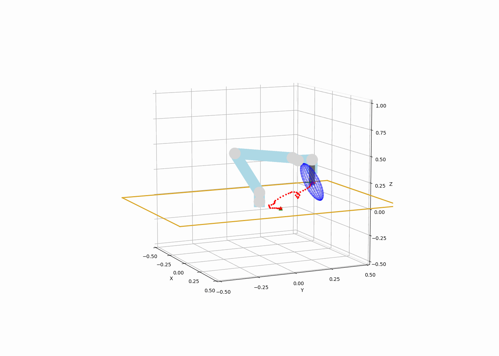

# RRT* with Reflected Inertia (RI) Optimization




### Figure 1. UR5 path with RI Maximization in the goal direction


## Overview

This project computes an RRT path optimizing the reflected inertia at the end effector in the direction of the goal. First, the RRT* path will be displayed, and finally, a visualization is shown.

## Instructions

### 1. Create and Activate the Conda Environment

1. **Ensure you have Conda installed.** If not, you can install it from [Miniconda](https://docs.conda.io/en/latest/miniconda.html) or [Anaconda](https://www.anaconda.com/products/distribution).

2. **Create the Conda environment** using the provided `environment.yaml` file:

    ```bash
    conda env create --file environment.yaml
    ```

3. **Activate the Conda environment:**

    ```bash
    conda activate project1
    ```

### 2. Update URDF Paths

1. **Run the script** to update the paths in your URDF file. This script will replace the existing paths with the correct project path:

    ```bash
    python scripts/update_urdf_paths.py
    ```

### 3. Run the Algorithm

1. **Run the code example:**

    ```bash
    python scripts/RRTstar_3D_with_RI_optimization.py
    ```

2. **Run an experiment with multiple workers. You can configure the experiment inside the `ExperimentRunner.py` file:**

    ```bash
    python scripts/ExperimentRunner.py
    ```


